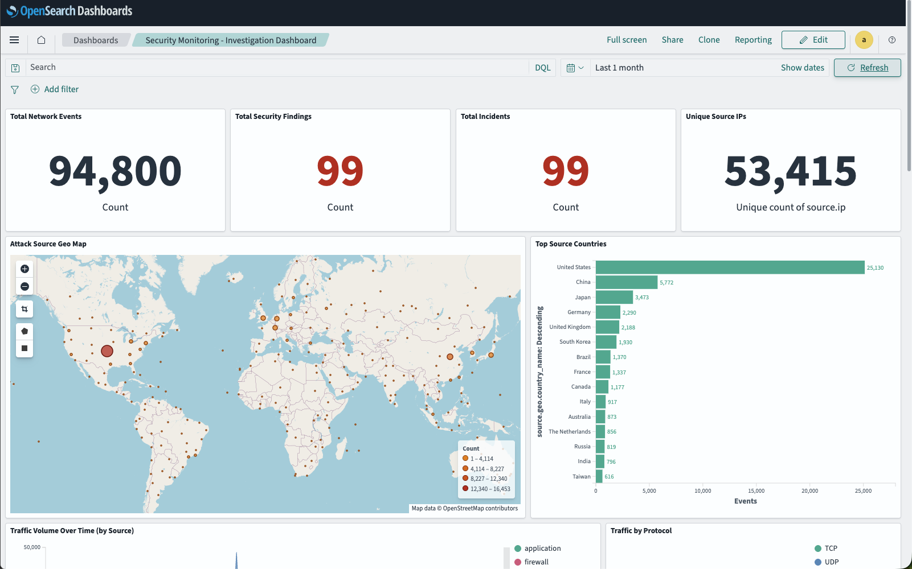
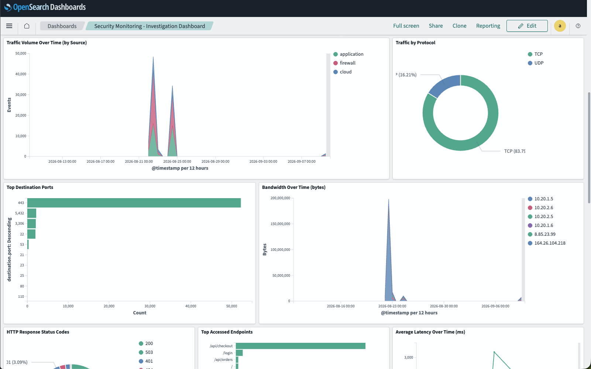
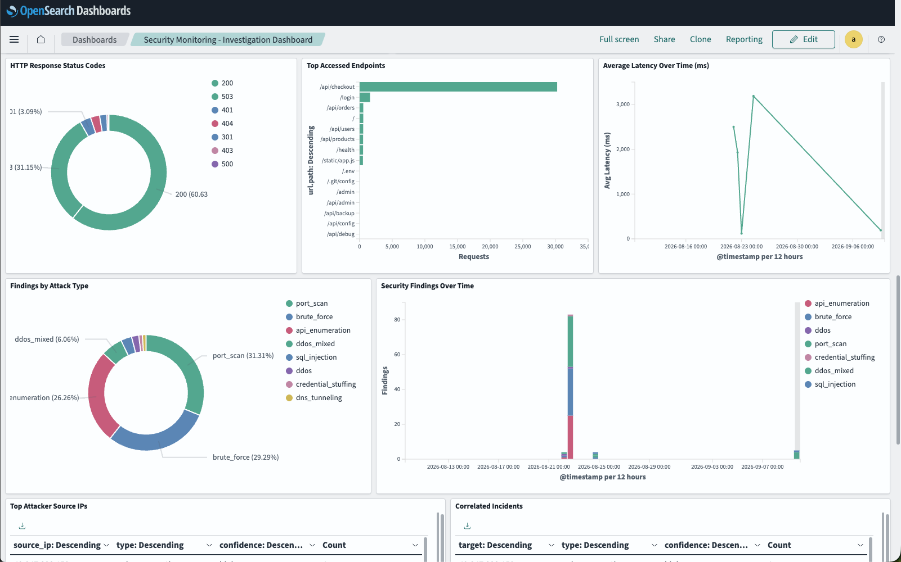
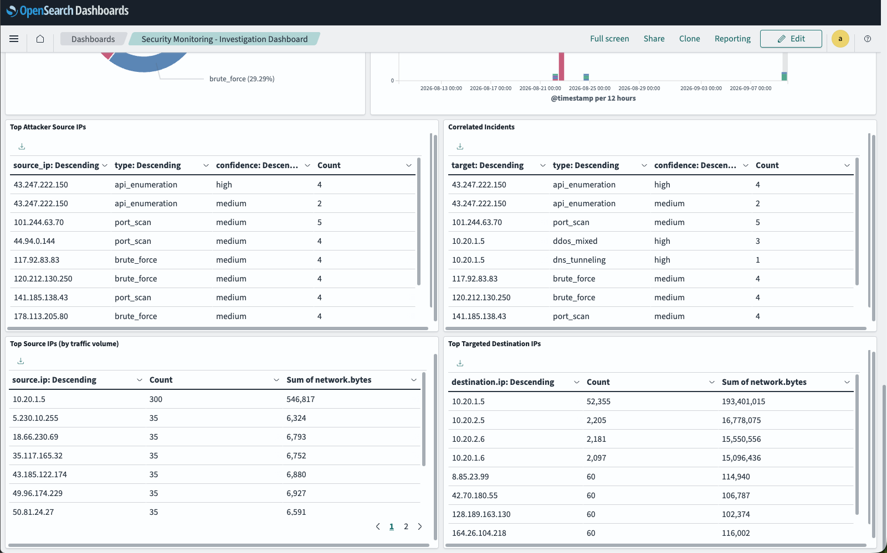

# Application Security Monitoring Sandbox

**A self-hosted, multi-source security monitoring pipeline on OpenSearch — from raw log ingestion to attack detection, correlation, and an investigation dashboard.**


This is a local, reproducible sandbox for learning and building a real detection pipeline end to end:

```
Log sources → normalization → rule-based detection → correlation → dashboard
 (firewall,    (Data Prepper,   (custom engine:        (incidents)   (OpenSearch
  cloud, app)   → ECS schema)     8 detections)                       Dashboards)
```

Everything runs on `localhost` via Docker Compose. Traffic is simulated by Python generators (normal baseline + eight attack scenarios), so you can watch detections fire against data you control.

> **Why OpenSearch, not Kibana?** This stack uses **OpenSearch + OpenSearch Dashboards**. Kibana is Elastic's proprietary UI and doesn't run against OpenSearch. (The folder is named "Kibana Monitoring Tool" for historical reasons only.)

---

## Architecture

| Component | Role |
|---|---|
| **OpenSearch** | Storage + search engine (indices, aggregations) |
| **OpenSearch Dashboards** | UI and visualizations |
| **Data Prepper** | Ingest pipelines — parse and normalize genuinely different raw log formats into one common ECS-style schema, with GeoIP enrichment |
| **Log generators** (Python) | Simulate firewall / cloud / application traffic: a realistic normal baseline plus eight attack scenarios |
| **Detection engine** (Python) | Rule-based detections run directly against OpenSearch, plus a correlation layer that groups related findings into incidents |

Each source writes to `network-events-<source>-*`. Because all three normalize to the **same** ECS field names (`source.ip`, `destination.ip`, `network.bytes`, ...), cross-source detection and correlation query `network-events-*` uniformly. See [`docs/DATA_SCHEMA.md`](docs/DATA_SCHEMA.md) for the ECS-vs-OCSF reasoning and per-source field mappings.

## Detections

| Detection | Signal |
|---|---|
| **Port scan** | One source IP touching many distinct destination ports in a short window |
| **Brute force** | Repeated failed logins (401) from a single IP against `/login` |
| **Credential stuffing** | Many distinct IPs, few attempts each, high collective failure rate on `/login` |
| **API enumeration** | One IP hitting many distinct paths with a high 401/403/404 ratio |
| **SQL injection** | Known SQLi patterns in request paths from the same source IP |
| **DNS tunneling** | High volume of oversized queries to port 53 from one source |
| **DDoS** | Multi-signal, baseline-relative: rate spike + source cardinality + latency + 5xx rate (requires ≥3 signals to agree) |
| **DDoS classifier** | Sub-classifies a detected DDoS as volumetric / protocol (SYN flood) / application-layer |

Findings are correlated into **incidents** by shared target, then persisted to `security-findings-*` and `security-incidents-*` for visualization. See [`docs/DETECTION_USE_CASES.md`](docs/DETECTION_USE_CASES.md) for what each rule catches and how to test it.

---

## Dashboard

The **Security Monitoring – Investigation Dashboard** ties everything together in OpenSearch Dashboards — from high-level counts down to individual attacker IPs and correlated incidents.

**Overview** — total network events, security findings, incidents, and unique source IPs, with a GeoIP attack-source map and top source countries.



**Traffic** — traffic volume over time by source, protocol split (TCP/UDP), top destination ports, and bandwidth over time.



**Findings** — HTTP response codes, top accessed endpoints, average latency, and findings broken down by attack type over time.



**Incidents** — top attacker source IPs, correlated incidents by target and confidence, and the top source / targeted destination IPs by traffic volume.



Build it yourself with `dashboards/create_dashboard.sh` (see [Quick start](#5-view-the-dashboard)).

---

## Quick start

### 1. Start the stack

```bash
cp .env.example .env          # sandbox-only credentials, localhost only
docker compose up -d
```

Wait for OpenSearch to report healthy, then open Dashboards at **http://localhost:5601** (login: `admin` / the password in `.env`).

### 2. Apply the index templates (once)

```bash
for name in network-events security-findings security-incidents; do
  curl -sk -u admin:"$(grep OPENSEARCH_ADMIN_PASSWORD .env | cut -d= -f2)" \
    -X PUT "https://localhost:9200/_index_template/${name}" \
    -H 'Content-Type: application/json' \
    -d @opensearch/index-template-${name}.json
done
```

### 3. Generate traffic

Run from `log-generator/` — no dependencies beyond the Python standard library. **Always start with the baseline**; detections compare against it.

```bash
cd log-generator
python3 generate_normal_traffic.py --minutes 10   # baseline first, always

# then any attack scenario(s):
python3 generate_portscan.py
python3 generate_bruteforce.py
python3 generate_credential_stuffing.py
python3 generate_api_enumeration.py
python3 generate_sqli.py
python3 generate_dns_tunneling.py
python3 generate_ddos.py
python3 generate_ddos_volumetric.py
python3 generate_ddos_syn_flood.py
```

### 4. Run detections

```bash
cd detection-engine
python3 -m venv .venv && source .venv/bin/activate
pip install -r requirements.txt
python3 main.py
```

`main.py` runs every rule, prints findings, correlates them into incidents, and persists both to OpenSearch.

### 5. View the dashboard

```bash
cd dashboards
./create_dashboard.sh   # idempotent, safe to re-run
```

Then open **http://localhost:5601/app/dashboards** → *Security Monitoring – Investigation Dashboard*. See [`dashboards/dashboard-configuration.md`](dashboards/dashboard-configuration.md) for what each panel shows.

---

## Project layout

```
.
├── docker-compose.yml
├── .env / .env.example
├── data-prepper/
│   ├── pipelines.yaml            # one pipeline per source, normalizing to ECS
│   └── data-prepper-config.yaml
├── opensearch/
│   ├── index-template-network-events.json
│   ├── index-template-security-findings.json
│   ├── index-template-security-incidents.json
│   └── detection-rules/          # future: Sigma rules for the Security Analytics plugin
├── log-generator/
│   ├── common.py                 # shared helpers, per-source raw log emitters
│   ├── generate_normal_traffic.py
│   ├── generate_portscan.py
│   ├── generate_bruteforce.py
│   ├── generate_credential_stuffing.py
│   ├── generate_api_enumeration.py
│   ├── generate_sqli.py
│   ├── generate_dns_tunneling.py
│   ├── generate_ddos.py
│   ├── generate_ddos_volumetric.py
│   ├── generate_ddos_syn_flood.py
│   └── output/                   # generated raw logs (gitignored)
├── detection-engine/
│   ├── main.py                   # runs all rules + correlation + persists results
│   ├── opensearch_client.py
│   ├── persistence.py            # writes findings/incidents to OpenSearch
│   ├── rules/                    # one module per detection (+ mocked unit tests)
│   └── correlation/
│       └── incident_engine.py
├── dashboards/
│   ├── create_dashboard.sh       # builds index patterns + visualizations + dashboard
│   └── dashboard-configuration.md
└── docs/
    ├── LEARNING_PATH.md           # phased build order — read this first
    ├── ARCHITECTURE.md            # system design
    ├── DATA_SCHEMA.md             # ECS rationale + per-source field mappings
    └── DETECTION_USE_CASES.md     # what each rule detects and how to test it
```

## Build status

Full phase-by-phase plan in [`docs/LEARNING_PATH.md`](docs/LEARNING_PATH.md).

- [x] Sandbox up (OpenSearch + Dashboards + Data Prepper)
- [x] First log source (firewall) end to end
- [x] Cloud + application sources; normalization proven across genuinely different formats
- [x] Realistic normal-traffic baseline generator
- [x] Rule-based detections: port scan, brute force, credential stuffing, API enumeration, SQL injection, DNS tunneling
- [x] DDoS detection (multi-signal, baseline-relative) + volumetric / SYN-flood classifiers + correlation into incidents
- [x] Investigation dashboard

**Next:** native OpenSearch plugins — Security Analytics (Sigma rules) and Anomaly Detection (RCF). The ECS schema was chosen specifically to make that migration smooth once the custom detection engine is solid.

---

## Notes

- **Credentials are sandbox-only.** The password lives in `.env.example` and as fallbacks in code — fine for a throwaway localhost stack, not for anything real. Override via environment variables (`OPENSEARCH_ADMIN_PASSWORD`, `OPENSEARCH_PASSWORD`) for any non-local use.
- **GeoIP enrichment** uses Data Prepper's bundled MaxMind databases. If the container can't reach MaxMind's CDN to refresh them, `source.geo.*` fields may be missing — harmless for detection, but it affects the dashboard's map panel.
- **Single-node** OpenSearch reports cluster health `yellow` (replicas can't be allocated). Expected and harmless for a sandbox.
